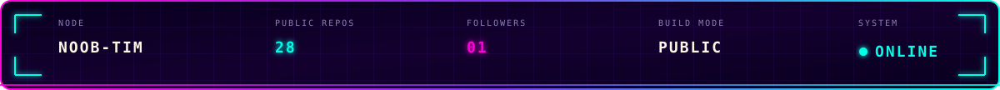
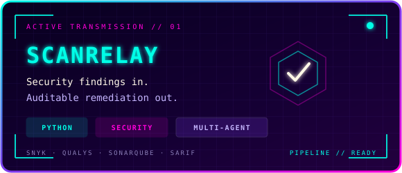
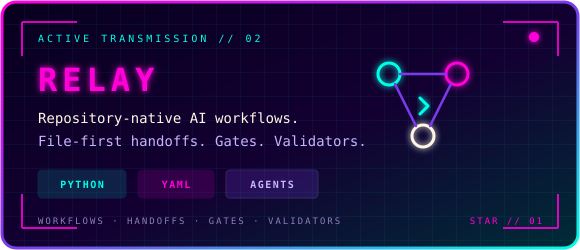
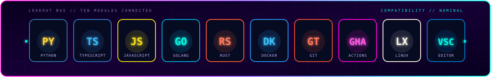

  

  

## `// whoami`

I build practical **AI workflows**, **security remediation automation**, and **developer tools**. My focus is making multi-agent systems auditable, repeatable, and useful in real repositories.

- `focus` — repository-native AI workflows and agent handoffs
- `building` — security scan normalization, triage, remediation, and verification flows
- `exploring` — Python, TypeScript, Go, Rust, Docker, MCP, and GitHub Actions
- `status` — building in public and open to useful collaboration

## `// active_transmissions`

| Project | Signal |
| --- | --- |
| [**ScanRelay**](https://github.com/Noob-Tim/ScanRelay) | Turns Snyk, Qualys, SonarQube, and SARIF reports into an auditable multi-agent remediation workflow. |
| [**relay**](https://github.com/Noob-Tim/relay) | A repository-native AI workflow system with file-first handoffs, YAML workflows, gates, and validators. |
| [**ExaFree**](https://github.com/Noob-Tim/ExaFree-main) | An extended Exa API proxy and admin console with multi-account routing, user API keys, OAuth, and MCP access. |

  
  

## `// tech_loadout`

  

## `// system_telemetry`

  

## `// contribution_protocol`

<picture>
  <source media="(prefers-color-scheme: dark)" srcset="https://raw.githubusercontent.com/Noob-Tim/Noob-Tim/output/github-contribution-grid-snake-dark.svg" />
  <source media="(prefers-color-scheme: light)" srcset="https://raw.githubusercontent.com/Noob-Tim/Noob-Tim/output/github-contribution-grid-snake.svg" />
  
</picture>

  <code>BUILD → VERIFY → DOCUMENT → REPEAT</code>

